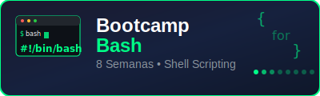

<div align="center">




</div>

# 🎓 Bootcamp Bash (bc_bash)

Un bootcamp completo de scripting en Bash dividido en 8 semanas progresivas, con sistema de commits automáticos integrado.

## 🚀 Sistema de Auto-Commit Incluido

Este proyecto incluye un **sistema de commits automáticos profesional** que puedes usar aquí y replicar en otros proyectos.

### ⚡ Uso Rápido

```bash
# Commits automáticos (recomendado)
./_scripts/commit.sh auto

# Ver estado
./_scripts/commit.sh status
```

### 📋 Replicar en Otros Proyectos

- 🚀 **[Guía de Instalación Rápida](_docs/setup/QUICK_SETUP.md)** - 10 minutos
- 📖 **[Guía Completa Paso a Paso](_docs/automation/auto-commit-replication-guide.md)** - Implementación detallada

## 📚 Contenido del Bootcamp

### Estructura del Proyecto

```text
bc_bash/
├── _docs/          # 📚 Documentación completa
├── _scripts/       # 🔧 Scripts de automatización
├── assets/         # 🎨 Logos y recursos visuales
└── bootcamp/       # 🎓 Contenido del bootcamp
    └── week-XX/    # 📖 Semana XX
        ├── README.md             # Descripción y objetivos
        ├── rubrica-evaluacion.md # Criterios de evaluación
        ├── 0-assets/             # Imágenes y diagramas
        ├── 1-teoria/             # Material teórico
        ├── 2-practicas/          # Ejercicios guiados
        ├── 3-proyecto/           # Proyecto semanal
        ├── 4-recursos/           # Recursos adicionales
        │   ├── ebooks-free/
        │   ├── videografia/
        │   └── webgrafia/
        └── 5-glosario/           # Términos clave
```

### Semanas del Bootcamp

| Semana | Tema                         | Proyecto Principal                |
| ------ | ---------------------------- | --------------------------------- |
| **1**  | Fundamentos de Bash          | Sistema de Gestión de Archivos    |
| **2**  | Comandos Avanzados y Pipes   | Procesador de Logs Avanzado       |
| **3**  | Variables y Control de Flujo | Sistema de Menús Interactivo      |
| **4**  | Funciones y Arrays           | Gestor Interactivo de Archivos    |
| **5**  | Operaciones de Archivos      | Analizador de Logs con Reportes   |
| **6**  | Manipulación Avanzada Datos  | Procesador de Datos Empresariales |
| **7**  | Optimización y Debugging     | Monitor de Sistema Avanzado       |
| **8**  | Proyectos y Automatización   | Sistema de Backup y Deploy        |

## 📋 Progresión de Aprendizaje

### 🎯 Semanas 1-2: Fundamentos

- **Semana 1**: Conceptos básicos de Bash y scripting
- **Semana 2**: Comandos avanzados y procesamiento de texto

### 🚀 Semanas 3-4: Programación

- **Semana 3**: Variables, condicionales y bucles
- **Semana 4**: Funciones y estructuras de datos

### 💪 Semanas 5-6: Aplicaciones

- **Semana 5**: Manipulación de archivos y directorios
- **Semana 6**: Procesamiento avanzado de datos

### 🏆 Semanas 7-8: Maestría

- **Semana 7**: Optimización, debugging y mejores prácticas
- **Semana 8**: Proyectos complejos y automatización empresarial

### ⏱️ Dedicación Sugerida

| Actividad             | Tiempo Semanal       |
| --------------------- | -------------------- |
| Teoría y conceptos    | 2-3 horas            |
| Ejercicios prácticos  | 2-3 horas            |
| **Total recomendado** | **4-6 horas/semana** |

> 💡 **Tip**: La práctica constante es más efectiva que sesiones largas esporádicas. Dedica al menos 30-60 minutos diarios para mejores resultados.

## 🎯 Características Destacadas

### ✨ Sistema de Commits Automáticos

- **Commits profesionales en inglés**
- **Detección automática de tipos** (feat, fix, docs, etc.)
- **Mínima intervención requerida**
- **Conventional Commits estándar**
- **Configurable y extensible**

### 📖 Contenido Educativo

- **Ejercicios prácticos** en cada semana
- **Proyectos reales** para aplicar conocimientos
- **Progresión gradual** de dificultad
- **Mejores prácticas** de shell scripting
- **Documentación completa**

## 🚀 Inicio Rápido

### 1. Clonar y Configurar

```bash
git clone <repository-url>
cd bc_bash
./_scripts/setup-auto-commit.sh
```

### 2. Explorar Semanas

```bash
# Comenzar con semana 1
cd bootcamp/week-01
cat README.md
```

### 3. Usar Auto-Commit

```bash
# Hacer cambios y commitear automáticamente
echo "Mi ejercicio" > bootcamp/week-01/mi_script.sh
./_scripts/commit.sh auto
```

## 📖 Documentación

### Documentación Principal

- **[README de Documentación](_docs/README.md)** - Descripción completa del proyecto
- **[Estrategia de Commits](_docs/automation/COMMIT_STRATEGY.md)** - Sistema de commits automáticos
- **[Plantillas](_docs/templates/)** - Templates para ejercicios

### Por Semana

Cada semana incluye:

- `README.md` - Objetivos y contenido
- `1-teoria/` - Material teórico
- `2-practicas/` - Ejercicios prácticos
- `3-proyecto/` - Proyecto semanal
- `4-recursos/` - Recursos adicionales
- `5-glosario/` - Términos clave

## 🔧 Scripts de Automatización

| Script            | Propósito            | Uso                          |
| ----------------- | -------------------- | ---------------------------- |
| `commit.sh`       | Entrada principal    | `./_scripts/commit.sh auto`  |
| `auto-commit.sh`  | Commits automáticos  | `./_scripts/auto-commit.sh`  |
| `quick-commit.sh` | Commits interactivos | `./_scripts/quick-commit.sh` |
| `demo.sh`         | Demostración         | `./_scripts/demo.sh`         |

## 🎨 Ejemplos de Commits Generados

```
feat(week-01): add calculator exercise solution
docs(docs): update installation guide
script(scripts): improve automation tools
fix(week-02): resolve syntax error in loop example
test(week-03): add function validation tests
```

## 🛠️ Tecnologías y Herramientas

- **Bash**: Shell scripting principal
- **Git**: Control de versiones con hooks automáticos
- **JSON**: Configuración flexible
- **Conventional Commits**: Estándar de mensajes
- **Markdown**: Documentación estructurada

## 📚 Recursos de Aprendizaje

### Prerrequisitos

- Sistema Linux/macOS (o WSL)
- Terminal con Bash
- Editor de texto
- Git instalado

### Recursos Externos

- [Manual oficial de Bash](https://www.gnu.org/software/bash/manual/)
- [Advanced Bash-Scripting Guide](https://tldp.org/LDP/abs/html/)
- [ShellCheck](https://www.shellcheck.net/) - Validación de scripts

## 🤝 Contribución

### Para Contribuir

1. Usar el sistema de commits: `./_scripts/commit.sh auto`
2. Seguir las convenciones de código establecidas
3. Documentar todos los cambios
4. Probar en múltiples entornos

### Estructura de Commits

```bash
# Automático (recomendado)
./_scripts/commit.sh auto

# Manual si necesitas control específico
git commit -m "feat(week-02): add advanced loop examples"
```

## 📞 Soporte

### ¿Problemas con Auto-Commit?

1. Verificar permisos: `chmod +x _scripts/*.sh`
2. Re-ejecutar setup: `./_scripts/setup-auto-commit.sh`
3. Revisar configuración: `./_scripts/commit.sh config`

### ¿Preguntas sobre Bash?

- Revisar documentación en `_docs/`
- Consultar ejercicios resueltos en cada semana
- Usar plantillas en `_docs/templates/`

---

## 🎉 ¿Por Qué Este Proyecto?

✅ **Aprende Bash de forma práctica**  
✅ **Implementa mejores prácticas desde el inicio**  
✅ **Obtén un sistema de commits profesional**  
✅ **Estructura escalable para cualquier proyecto**  
✅ **Documentación completa y ejemplos reales**

**¡Comienza tu viaje hacia la maestría en shell scripting!** 🚀

## 📄 Licencia

Este proyecto está licenciado bajo la Licencia MIT - ver el archivo [LICENSE](LICENSE) para más detalles.

### 🤝 Contribuciones

Las contribuciones son bienvenidas y apreciadas. Por favor lee nuestra [Guía de Contribución](CONTRIBUTING.md) para conocer cómo participar en este proyecto.

### 📋 Código de Conducta

Este proyecto adhiere al [Código de Conducta del Contributor Covenant](CODE_OF_CONDUCT.md). Al participar, se espera que mantengas este código.

### 🔒 Seguridad

Si encuentras una vulnerabilidad de seguridad, por favor sigue nuestra [Política de Seguridad](SECURITY.md) para reportarla de manera responsable.
