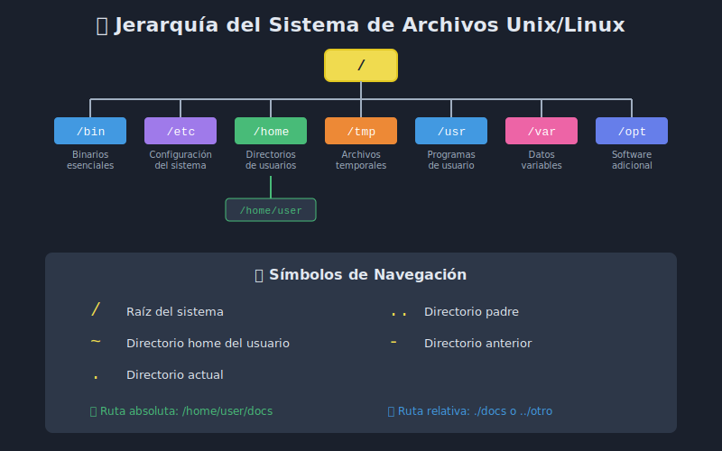

# 02 - Sistema de Archivos Unix/Linux

## 🎯 Objetivos

- Entender la jerarquía del sistema de archivos Unix/Linux
- Conocer los directorios principales y su propósito
- Diferenciar entre rutas absolutas y relativas
- Navegar eficientemente por el sistema

## 📋 Contenido

### 1. La Jerarquía del Sistema de Archivos

El sistema de archivos Unix/Linux es como un **árbol invertido** donde todo comienza desde la raíz `/`.



```
/                     ← Raíz (root)
├── bin/              ← Comandos esenciales
├── boot/             ← Archivos de arranque
├── dev/              ← Dispositivos
├── etc/              ← Configuración del sistema
├── home/             ← Directorios de usuarios
│   ├── usuario1/
│   └── usuario2/
├── lib/              ← Librerías del sistema
├── opt/              ← Software opcional
├── proc/             ← Información de procesos
├── root/             ← Home del superusuario
├── tmp/              ← Archivos temporales
├── usr/              ← Aplicaciones de usuario
│   ├── bin/
│   ├── lib/
│   └── share/
└── var/              ← Datos variables (logs, caché)
    └── log/
```

### 2. Directorios Principales

| Directorio | Propósito           | Ejemplo de contenido                |
| ---------- | ------------------- | ----------------------------------- |
| `/bin`     | Comandos esenciales | `ls`, `cp`, `mv`, `bash`            |
| `/etc`     | Configuración       | `passwd`, `hosts`, `fstab`          |
| `/home`    | Usuarios            | `/home/juan`, `/home/maria`         |
| `/usr`     | Aplicaciones        | Programas instalados                |
| `/var`     | Datos variables     | Logs, bases de datos                |
| `/tmp`     | Temporales          | Archivos que se borran al reiniciar |
| `/opt`     | Software adicional  | Aplicaciones de terceros            |

### 3. Rutas Absolutas vs Relativas

#### Ruta Absoluta

Comienza desde la raíz `/` y especifica la ubicación completa:

```bash
# Ruta absoluta
cd /home/usuario/documentos/proyecto

# Siempre funciona sin importar dónde estés
cat /etc/passwd
```

#### Ruta Relativa

Depende de tu ubicación actual:

```bash
# Si estás en /home/usuario
cd documentos/proyecto    # Relativa

# Usando . (directorio actual)
./script.sh

# Usando .. (directorio padre)
cd ../otro_usuario
```

### 4. Símbolos Especiales

| Símbolo | Significado         | Ejemplo                     |
| ------- | ------------------- | --------------------------- |
| `/`     | Raíz del sistema    | `cd /`                      |
| `~`     | Directorio home     | `cd ~` = `cd /home/usuario` |
| `.`     | Directorio actual   | `./script.sh`               |
| `..`    | Directorio padre    | `cd ..`                     |
| `-`     | Directorio anterior | `cd -`                      |

### 5. Explorando el Sistema

```bash
# Ver estructura de un directorio
ls -la /etc

# Ver el árbol de directorios (si está instalado)
tree /home/usuario -L 2

# Encontrar dónde está un archivo
find /etc -name "hosts"

# Ver espacio en disco
df -h

# Ver tamaño de un directorio
du -sh /home/usuario
```

### 6. Directorios Importantes para Scripts

| Ubicación        | Uso común                                   |
| ---------------- | ------------------------------------------- |
| `/usr/local/bin` | Scripts disponibles para todos los usuarios |
| `~/bin`          | Scripts personales del usuario              |
| `/opt/scripts`   | Scripts de la organización                  |
| `/var/log`       | Donde escribir logs                         |
| `/tmp`           | Archivos temporales de scripts              |

## 📊 Diagrama de Navegación

```
                    /
                    │
        ┌───────────┼───────────┐
        │           │           │
      home        etc         var
        │           │           │
    ┌───┴───┐   configuración  logs
    │       │
  usuario  otro
    │
  ┌─┴─┐
docs scripts
```

**Ejemplo de navegación:**

```bash
# Desde /home/usuario/docs
cd ..              # → /home/usuario
cd ../..           # → /home
cd /var/log        # → /var/log (absoluta)
cd ~/scripts       # → /home/usuario/scripts
```

## 📚 Recursos Adicionales

- [Filesystem Hierarchy Standard](https://refspecs.linuxfoundation.org/FHS_3.0/fhs/index.html)
- [Linux Directory Structure Explained](https://www.howtogeek.com/117435/htg-explains-the-linux-directory-structure-explained/)

## ✅ Checklist de Verificación

- [ ] Conozco los directorios principales (`/bin`, `/etc`, `/home`, `/var`)
- [ ] Entiendo la diferencia entre rutas absolutas y relativas
- [ ] Puedo usar los símbolos especiales (`~`, `.`, `..`, `-`)
- [ ] Sé dónde buscar archivos de configuración
- [ ] Puedo navegar eficientemente por el sistema

---

**Anterior**: [01-introduccion-terminal.md](01-introduccion-terminal.md) | **Siguiente**: [03-permisos.md](03-permisos.md)
