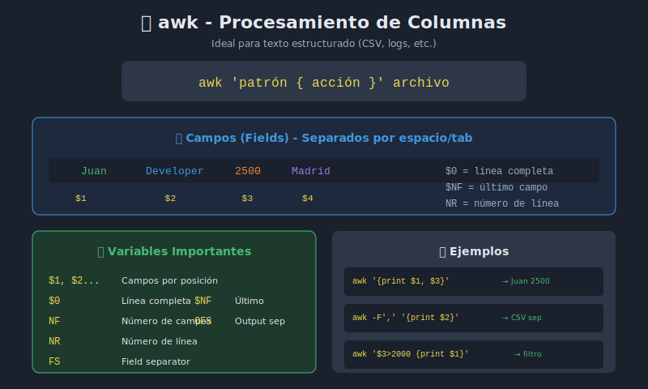

# 📊 awk - Procesamiento de Columnas

## 🎯 Objetivos

- Entender qué es awk y cuándo usarlo
- Procesar archivos por campos/columnas
- Aplicar condiciones y cálculos
- Crear reportes y estadísticas

## 📋 Contenido



### 1. ¿Qué es awk?

awk es un lenguaje de programación diseñado para procesar texto estructurado en columnas. Es ideal para:

- Archivos CSV/TSV
- Logs con formato consistente
- Salidas de comandos
- Cualquier texto con campos separados

```bash
# Sintaxis básica
awk 'patrón { acción }' archivo.txt

# Desde stdin
comando | awk '{ acción }'
```

### 2. Campos y Separadores

awk divide cada línea en campos numerados:

| Variable  | Significado                |
| --------- | -------------------------- |
| `$0`      | Línea completa             |
| `$1`      | Primer campo               |
| `$2`      | Segundo campo              |
| `$NF`     | Último campo               |
| `$(NF-1)` | Penúltimo campo            |
| `NF`      | Número de campos           |
| `NR`      | Número de registro (línea) |

```bash
# Crear archivo de ejemplo
cat > empleados.csv << 'EOF'
Juan,Desarrollador,2500,Madrid
María,Diseñadora,2200,Barcelona
Pedro,Administrador,2800,Valencia
Ana,Desarrolladora,2600,Madrid
Luis,Diseñador,2100,Sevilla
EOF

# Imprimir primer campo (nombre)
awk -F',' '{print $1}' empleados.csv

# Imprimir nombre y salario
awk -F',' '{print $1, $3}' empleados.csv

# Imprimir último campo (ciudad)
awk -F',' '{print $NF}' empleados.csv

# Imprimir línea completa
awk '{print $0}' empleados.csv
```

### 3. Especificar Separador

```bash
# Separador de campo de entrada (-F)
awk -F',' '{print $1}' archivo.csv      # Coma
awk -F':' '{print $1}' /etc/passwd      # Dos puntos
awk -F'\t' '{print $1}' archivo.tsv     # Tab

# Múltiples separadores
awk -F'[,;:]' '{print $1}' archivo.txt

# Separador de salida (OFS)
awk -F',' 'BEGIN{OFS="\t"} {print $1,$2,$3}' archivo.csv
```

### 4. Patrones y Condiciones

```bash
# Solo líneas que contienen patrón
awk '/Madrid/' empleados.csv

# Condición numérica
awk -F',' '$3 > 2500' empleados.csv

# Condición de texto
awk -F',' '$2 == "Desarrollador"' empleados.csv

# Múltiples condiciones
awk -F',' '$3 > 2000 && $4 == "Madrid"' empleados.csv

# Condición OR
awk -F',' '$4 == "Madrid" || $4 == "Barcelona"' empleados.csv

# Negación
awk -F',' '$4 != "Madrid"' empleados.csv

# Expresión regular en campo específico
awk -F',' '$2 ~ /Desarrollador/' empleados.csv
awk -F',' '$2 !~ /Diseñador/' empleados.csv
```

### 5. Bloques BEGIN y END

```bash
# BEGIN: se ejecuta antes de procesar el archivo
# END: se ejecuta después de procesar todo

awk -F',' '
BEGIN {
    print "=== REPORTE DE EMPLEADOS ==="
    print "Nombre\t\tSalario"
    print "------------------------"
}
{
    print $1 "\t\t" $3
}
END {
    print "------------------------"
    print "Total registros:", NR
}
' empleados.csv
```

### 6. Variables y Cálculos

```bash
# Suma de salarios
awk -F',' '{suma += $3} END {print "Total:", suma}' empleados.csv

# Promedio
awk -F',' '{suma += $3} END {print "Promedio:", suma/NR}' empleados.csv

# Máximo y mínimo
awk -F',' '
BEGIN {max=0; min=999999}
{
    if ($3 > max) max = $3
    if ($3 < min) min = $3
}
END {
    print "Máximo:", max
    print "Mínimo:", min
}
' empleados.csv

# Contar por categoría
awk -F',' '{count[$4]++} END {for (c in count) print c, count[c]}' empleados.csv
```

### 7. Formatear Salida con printf

```bash
# printf permite formato preciso
awk -F',' '{printf "%-15s %10d €\n", $1, $3}' empleados.csv

# Formatos comunes
# %s  - string
# %d  - entero
# %f  - decimal
# %-  - alinear izquierda
# %10 - ancho mínimo 10

# Ejemplo con decimales
awk -F',' '{printf "%-15s %10.2f\n", $1, $3/12}' empleados.csv
```

### 8. Arrays Asociativos

```bash
# Agrupar por ciudad
awk -F',' '
{
    ciudades[$4] += $3
    conteo[$4]++
}
END {
    for (c in ciudades) {
        printf "%-12s: %d empleados, total salarios: %d\n", c, conteo[c], ciudades[c]
    }
}
' empleados.csv

# Sumar por categoría
awk -F',' '
{
    roles[$2] += $3
}
END {
    for (r in roles) {
        print r ":", roles[r]
    }
}
' empleados.csv
```

### 9. Funciones Incorporadas

#### Funciones de String

```bash
# length() - longitud
awk '{print length($0)}' archivo.txt

# substr() - subcadena
awk '{print substr($1, 1, 3)}' archivo.txt  # Primeros 3 caracteres

# toupper() / tolower() - mayúsculas/minúsculas
awk '{print toupper($1)}' archivo.txt

# gsub() - sustitución global
awk '{gsub(/viejo/, "nuevo"); print}' archivo.txt

# split() - dividir en array
awk '{n = split($0, arr, ","); print arr[1], arr[2]}' archivo.txt

# index() - posición de subcadena
awk '{print index($0, "buscar")}' archivo.txt
```

#### Funciones Numéricas

```bash
# int() - parte entera
awk '{print int(3.7)}'  # 3

# sqrt() - raíz cuadrada
awk 'BEGIN {print sqrt(16)}'  # 4

# sin(), cos(), log(), exp()
awk 'BEGIN {print sin(3.14159/2)}'  # ~1
```

### 10. Variables Especiales

| Variable   | Descripción                     |
| ---------- | ------------------------------- |
| `FS`       | Separador de campo de entrada   |
| `OFS`      | Separador de campo de salida    |
| `RS`       | Separador de registro (línea)   |
| `ORS`      | Separador de registro de salida |
| `NR`       | Número de registro actual       |
| `NF`       | Número de campos en registro    |
| `FILENAME` | Nombre del archivo actual       |

```bash
# Cambiar separadores
awk 'BEGIN {FS=","; OFS="\t"} {print $1, $2, $3}' archivo.csv

# Procesar registros multi-línea
awk 'BEGIN {RS=""; FS="\n"} {print $1}' archivo.txt
```

## 📊 Casos de Uso Reales

### Análisis de Logs

```bash
# Contar códigos HTTP
awk '{print $9}' access.log | sort | uniq -c | sort -rn

# IPs con más peticiones
awk '{print $1}' access.log | sort | uniq -c | sort -rn | head -10

# Bytes transferidos por IP
awk '{bytes[$1] += $10} END {for (ip in bytes) print ip, bytes[ip]}' access.log
```

### Procesar /etc/passwd

```bash
# Listar usuarios y shells
awk -F':' '{print $1, $7}' /etc/passwd

# Usuarios con shell bash
awk -F':' '$7 ~ /bash/' /etc/passwd

# Contar usuarios por shell
awk -F':' '{shells[$7]++} END {for (s in shells) print s, shells[s]}' /etc/passwd
```

### Procesar CSV

```bash
# Saltar encabezado
awk -F',' 'NR > 1 {print $1, $2}' datos.csv

# Convertir CSV a JSON (simplificado)
awk -F',' '
NR > 1 {
    printf "{\"nombre\": \"%s\", \"cargo\": \"%s\", \"salario\": %s}\n", $1, $2, $3
}
' empleados.csv

# Filtrar y reformatear
awk -F',' 'NR > 1 && $3 > 2000 {printf "%s trabaja en %s\n", $1, $4}' empleados.csv
```

### Estadísticas de Archivos

```bash
# Tamaño total de archivos .log
ls -l *.log | awk '{total += $5} END {print "Total:", total, "bytes"}'

# Promedio de tamaño
ls -l *.txt | awk '{sum+=$5; count++} END {print "Promedio:", sum/count}'
```

## 📚 Referencia Rápida

```bash
# Imprimir campos
awk '{print $1, $3}'           # Campos 1 y 3
awk '{print $NF}'              # Último campo
awk '{print NR, $0}'           # Número de línea + línea

# Filtrar
awk '/patrón/'                 # Líneas con patrón
awk '$3 > 100'                 # Campo 3 mayor a 100
awk 'NR > 1'                   # Saltar primera línea

# Calcular
awk '{sum += $1} END {print sum}'          # Suma
awk '{sum += $1} END {print sum/NR}'       # Promedio
awk '{if ($1 > max) max = $1} END {print max}'  # Máximo

# Agrupar
awk '{count[$1]++} END {for (k in count) print k, count[k]}'
```

## ✅ Checklist de Verificación

- [ ] Puedo especificar separadores con -F
- [ ] Sé acceder a campos con $1, $2, $NF
- [ ] Puedo aplicar condiciones y patrones
- [ ] Entiendo BEGIN y END
- [ ] Puedo hacer cálculos (suma, promedio)
- [ ] Sé usar printf para formatear
- [ ] Puedo usar arrays asociativos para agrupar

---

[← Anterior: sed](03-sed-transformacion.md) | [Volver al índice →](README.md)
