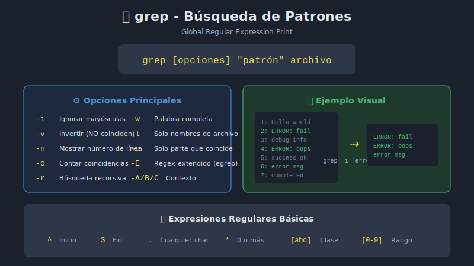

# 🔍 grep - Búsqueda y Filtrado de Texto

## 🎯 Objetivos

- Dominar el comando `grep` para búsqueda de patrones
- Conocer las opciones más útiles de grep
- Introducción a expresiones regulares básicas
- Combinar grep con otros comandos

## 📋 Contenido



### 1. ¿Qué es grep?

**G**lobal **R**egular **E**xpression **P**rint - Busca patrones en texto y muestra las líneas que coinciden.

```bash
# Sintaxis básica
grep "patrón" archivo.txt

# Buscar en múltiples archivos
grep "patrón" *.txt

# Buscar desde stdin (pipe)
cat archivo.txt | grep "patrón"
```

### 2. Opciones Esenciales

| Opción | Descripción                        | Ejemplo                      |
| ------ | ---------------------------------- | ---------------------------- |
| `-i`   | Ignorar mayúsculas/minúsculas      | `grep -i "error" log.txt`    |
| `-v`   | Invertir (líneas que NO coinciden) | `grep -v "debug" log.txt`    |
| `-n`   | Mostrar número de línea            | `grep -n "TODO" script.sh`   |
| `-c`   | Contar coincidencias               | `grep -c "error" log.txt`    |
| `-l`   | Solo nombres de archivo            | `grep -l "main" *.c`         |
| `-r`   | Búsqueda recursiva                 | `grep -r "TODO" src/`        |
| `-w`   | Palabra completa                   | `grep -w "log" archivo.txt`  |
| `-o`   | Solo la parte que coincide         | `grep -o "[0-9]+" datos.txt` |

### 3. Ejemplos Prácticos

#### Búsqueda Básica

```bash
# Crear archivo de ejemplo
cat > empleados.txt << 'EOF'
Juan Pérez, Desarrollador, 2500, Madrid
María García, Diseñadora, 2200, Barcelona
Pedro López, Administrador, 2800, Valencia
Ana Martín, Desarrolladora, 2600, Madrid
Luis Rodríguez, Diseñador, 2100, Sevilla
Carmen Sánchez, Administradora, 2750, Madrid
EOF

# Buscar empleados de Madrid
grep "Madrid" empleados.txt

# Buscar insensible a mayúsculas
grep -i "madrid" empleados.txt

# Buscar desarrolladores (ambos géneros)
grep -i "desarrollador" empleados.txt
```

#### Búsqueda Inversa

```bash
# Mostrar todos EXCEPTO Madrid
grep -v "Madrid" empleados.txt

# Excluir comentarios de un script
grep -v "^#" script.sh

# Excluir líneas vacías
grep -v "^$" archivo.txt
```

#### Búsqueda con Contexto

```bash
# Mostrar 2 líneas antes de la coincidencia
grep -B 2 "ERROR" log.txt

# Mostrar 2 líneas después
grep -A 2 "ERROR" log.txt

# Mostrar 2 líneas antes y después
grep -C 2 "ERROR" log.txt
```

#### Búsqueda Recursiva

```bash
# Buscar en todos los archivos de un directorio
grep -r "TODO" proyecto/

# Buscar solo en archivos .sh
grep -r --include="*.sh" "function" scripts/

# Excluir directorios
grep -r --exclude-dir=node_modules "import" src/
```

### 4. Expresiones Regulares Básicas

grep soporta expresiones regulares para patrones más complejos:

| Patrón | Significado               | Ejemplo                               |
| ------ | ------------------------- | ------------------------------------- |
| `.`    | Cualquier carácter        | `grep "h.la" archivo` → hola, hala    |
| `^`    | Inicio de línea           | `grep "^Error" log.txt`               |
| `$`    | Fin de línea              | `grep "fin$" archivo.txt`             |
| `*`    | 0 o más del anterior      | `grep "ab*c" archivo` → ac, abc, abbc |
| `[]`   | Conjunto de caracteres    | `grep "[aeiou]" archivo`              |
| `[^]`  | Negación de conjunto      | `grep "[^0-9]" archivo`               |
| `\`    | Escapar carácter especial | `grep "\." archivo`                   |

#### Ejemplos con Regex

```bash
# Líneas que empiezan con número
grep "^[0-9]" archivo.txt

# Líneas que terminan con punto
grep "\.$" archivo.txt

# Buscar direcciones IP (patrón básico)
grep "[0-9]\{1,3\}\.[0-9]\{1,3\}\.[0-9]\{1,3\}\.[0-9]\{1,3\}" log.txt

# Buscar emails (patrón simplificado)
grep "[a-zA-Z0-9._%+-]*@[a-zA-Z0-9.-]*\.[a-zA-Z]\{2,\}" archivo.txt

# Buscar fechas formato YYYY-MM-DD
grep "[0-9]\{4\}-[0-9]\{2\}-[0-9]\{2\}" log.txt
```

### 5. grep Extendido (egrep / grep -E)

Con `-E` se activan expresiones regulares extendidas:

| Patrón  | Significado          | Ejemplo                              |
| ------- | -------------------- | ------------------------------------ | --------------- | --------- |
| `+`     | 1 o más del anterior | `grep -E "ab+c"` → abc, abbc (no ac) |
| `?`     | 0 o 1 del anterior   | `grep -E "colou?r"` → color, colour  |
| `       | `                    | Alternativa (OR)                     | `grep -E "error | warning"` |
| `()`    | Agrupación           | `grep -E "(ab)+c"` → abc, ababc      |
| `{n}`   | Exactamente n veces  | `grep -E "[0-9]{4}"` → 4 dígitos     |
| `{n,m}` | Entre n y m veces    | `grep -E "[0-9]{2,4}"`               |

```bash
# Buscar ERROR o WARNING
grep -E "ERROR|WARNING" log.txt

# Buscar color o colour
grep -E "colou?r" archivo.txt

# Números de teléfono (patrón)
grep -E "[0-9]{3}-[0-9]{3}-[0-9]{4}" contactos.txt

# Palabras que empiezan con vocal
grep -E "^[aeiouAEIOU]" palabras.txt
```

### 6. Combinaciones Útiles con Pipes

```bash
# Contar errores únicos
grep "ERROR" log.txt | sort | uniq -c | sort -rn

# Extraer IPs de errores
grep "ERROR" log.txt | grep -oE "[0-9]+\.[0-9]+\.[0-9]+\.[0-9]+" | sort -u

# Buscar y mostrar solo nombre de archivo
grep -l "TODO" *.sh | xargs basename -a

# Filtrar procesos y extraer PID
ps aux | grep nginx | grep -v grep | awk '{print $2}'

# Buscar en logs comprimidos
zgrep "ERROR" /var/log/syslog.*.gz
```

### 7. Variantes de grep

| Comando | Equivalente | Uso                            |
| ------- | ----------- | ------------------------------ |
| `egrep` | `grep -E`   | Regex extendidas               |
| `fgrep` | `grep -F`   | Búsqueda literal (sin regex)   |
| `zgrep` | -           | Buscar en archivos comprimidos |
| `rgrep` | `grep -r`   | Búsqueda recursiva             |

```bash
# Búsqueda literal (útil cuando el patrón tiene caracteres especiales)
fgrep "precio: $100" archivo.txt

# Buscar en .gz
zgrep "error" /var/log/syslog.2.gz
```

## 📊 Casos de Uso Reales

### Análisis de Logs

```bash
# Errores de las últimas 24 horas
grep "$(date -d 'yesterday' +%Y-%m-%d)" /var/log/syslog | grep -i error

# Top 10 IPs con más errores 404
grep " 404 " access.log | awk '{print $1}' | sort | uniq -c | sort -rn | head -10
```

### Desarrollo

```bash
# TODOs en el código
grep -rn "TODO\|FIXME\|XXX" src/

# Funciones no utilizadas (buscar declaración vs uso)
grep -r "function mi_funcion" --include="*.sh" .
```

## ✅ Checklist de Verificación

- [ ] Puedo buscar patrones con grep
- [ ] Conozco las opciones -i, -v, -n, -c, -r
- [ ] Puedo usar expresiones regulares básicas
- [ ] Sé usar grep -E para regex extendidas
- [ ] Puedo combinar grep con pipes

---

[← Anterior: Pipes](01-pipes-redireccion.md) | [Siguiente: sed →](03-sed-transformacion.md)
