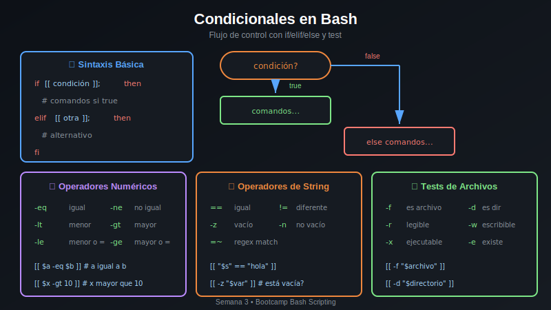

# 🔀 Práctica 01: Condicionales if/elif/else

> **Dificultad**: ⭐ Básica | **Tiempo estimado**: 25-30 minutos

## 🎯 Objetivos

Al completar esta práctica aprenderás a:

- ✅ Usar la sintaxis básica de `if/elif/else`
- ✅ Aplicar operadores de comparación numérica (`-eq`, `-lt`, `-gt`, `-ge`, `-le`)
- ✅ Comparar cadenas de texto (`==`, `!=`, `-z`, `-n`)
- ✅ Verificar propiedades de archivos (`-f`, `-d`, `-e`, `-r`, `-w`, `-x`)
- ✅ Combinar condiciones con `&&` (AND) y `||` (OR)

## 📚 Conceptos Clave



### Sintaxis Básica

```bash
if [[ condición ]]; then
    # código si verdadero
elif [[ otra_condición ]]; then
    # código alternativo
else
    # código si todo es falso
fi
```

### Operadores de Comparación

| Tipo     | Operador | Significado     |
| -------- | -------- | --------------- |
| Numérico | `-eq`    | Igual           |
| Numérico | `-ne`    | Diferente       |
| Numérico | `-lt`    | Menor que       |
| Numérico | `-le`    | Menor o igual   |
| Numérico | `-gt`    | Mayor que       |
| Numérico | `-ge`    | Mayor o igual   |
| String   | `==`     | Igual           |
| String   | `!=`     | Diferente       |
| String   | `-z`     | Cadena vacía    |
| String   | `-n`     | Cadena no vacía |

### Tests de Archivos

| Test | Significado        |
| ---- | ------------------ |
| `-f` | Es archivo regular |
| `-d` | Es directorio      |
| `-e` | Existe             |
| `-r` | Es legible         |
| `-w` | Es escribible      |
| `-x` | Es ejecutable      |

---

## 📋 Instrucciones

**Abre** [starter/script.sh](starter/script.sh) y sigue los pasos descomentando el código indicado.

Después de descomentar cada sección, ejecuta el script para ver los resultados:

```bash
cd starter
chmod +x script.sh
./script.sh
```

---

## Paso 1: Comparación Numérica Básica

El operador `-gt` (greater than) compara si un número es mayor que otro:

```bash
numero=15
if [[ $numero -gt 0 ]]; then
    echo "$numero es positivo"
fi
```

**Abre `starter/script.sh`** y descomenta la sección del Paso 1.

---

## Paso 2: Estructura Completa if/elif/else

Podemos manejar múltiples casos con `elif`:

```bash
if [[ $numero -gt 0 ]]; then
    echo "Positivo"
elif [[ $numero -lt 0 ]]; then
    echo "Negativo"
else
    echo "Cero"
fi
```

**Descomenta** la sección del Paso 2 en `starter/script.sh`.

---

## Paso 3: Verificar Existencia de Archivos

El test `-f` verifica si un archivo regular existe:

```bash
if [[ -f "/etc/passwd" ]]; then
    echo "El archivo existe"
else
    echo "El archivo NO existe"
fi
```

**Descomenta** la sección del Paso 3.

---

## Paso 4: Verificar Permisos

Podemos verificar permisos con `-r`, `-w`, `-x`:

```bash
if [[ -w "/tmp" ]]; then
    echo "/tmp es escribible"
fi
```

**Descomenta** la sección del Paso 4.

---

## Paso 5: Comparación de Strings

Para comparar cadenas usamos `==` o `!=`:

```bash
usuario="admin"
if [[ "$usuario" == "admin" ]]; then
    echo "Bienvenido administrador"
fi
```

**Descomenta** la sección del Paso 5.

---

## Paso 6: Cadenas Vacías

El operador `-z` verifica si una cadena está vacía, `-n` si no lo está:

```bash
nombre=""
if [[ -z "$nombre" ]]; then
    echo "El nombre está vacío"
fi

apellido="García"
if [[ -n "$apellido" ]]; then
    echo "Apellido: $apellido"
fi
```

**Descomenta** la sección del Paso 6.

---

## Paso 7: Condiciones Múltiples con AND

El operador `&&` requiere que AMBAS condiciones sean verdaderas:

```bash
edad=25
if [[ $edad -ge 18 && $edad -le 65 ]]; then
    echo "Edad laboral válida"
fi
```

**Descomenta** la sección del Paso 7.

---

## Paso 8: Condiciones con OR

El operador `||` requiere que AL MENOS UNA condición sea verdadera:

```bash
dia="sábado"
if [[ "$dia" == "sábado" || "$dia" == "domingo" ]]; then
    echo "¡Es fin de semana!"
fi
```

**Descomenta** la sección del Paso 8.

---

## Paso 9: Negación de Condiciones

El operador `!` niega una condición:

```bash
archivo="/tmp/test.txt"
if [[ ! -f "$archivo" ]]; then
    echo "El archivo NO existe"
fi
```

**Descomenta** la sección del Paso 9.

---

## Paso 10: Expresiones Regulares

El operador `=~` permite usar expresiones regulares:

```bash
email="user@example.com"
if [[ "$email" =~ ^[a-zA-Z0-9._%+-]+@[a-zA-Z0-9.-]+\.[a-zA-Z]{2,}$ ]]; then
    echo "Email válido"
fi
```

**Descomenta** la sección del Paso 10.

---

## ✅ Verificación

Al completar todos los pasos, tu script debería mostrar:

```
=== Práctica 01: Condicionales if/elif/else ===

--- Paso 1: Comparación Numérica ---
15 es un número positivo

--- Paso 2: if/elif/else completo ---
42 es POSITIVO

--- Paso 3: Verificar Archivos ---
✓ /etc/passwd existe

--- Paso 4: Verificar Permisos ---
✓ /tmp es escribible

--- Paso 5: Comparación de Strings ---
¡Bienvenido administrador!

--- Paso 6: Cadenas Vacías ---
✗ El nombre está vacío
✓ Apellido definido: García

--- Paso 7: AND lógico ---
✓ 25 está en edad laboral (18-65)

--- Paso 8: OR lógico ---
✓ ¡Es fin de semana!

--- Paso 9: Negación ---
✗ /tmp/archivo_inexistente.txt NO existe

--- Paso 10: Expresiones Regulares ---
✓ user@example.com es un email válido

✅ ¡Práctica completada!
```

---

## 🎓 Mejores Prácticas

1. **Usa `[[ ]]` en vez de `[ ]`**: Es más seguro y soporta más operadores
2. **Siempre usa comillas**: `"$variable"` previene errores con espacios
3. **Indenta el código**: Mejora la legibilidad
4. **Comenta condiciones complejas**: Explica la lógica

---

## 🔗 Recursos

- [Bash Manual - Conditional Constructs](https://www.gnu.org/software/bash/manual/html_node/Conditional-Constructs.html)
- [Test Operators](https://tldp.org/LDP/abs/html/comparison-ops.html)

---

## ➡️ Siguiente

Continúa con [Práctica 02: Bucles for](../practica-02-bucles-for/README.md)
