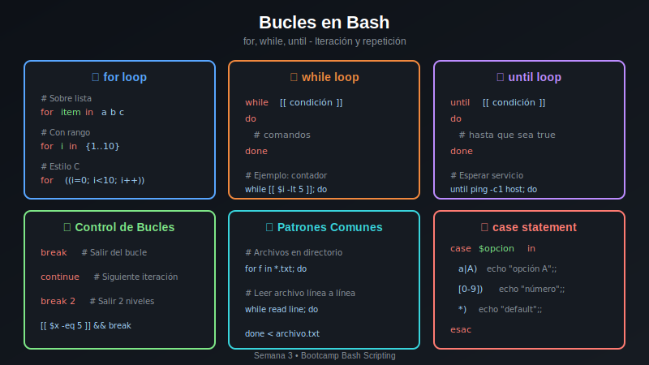

# 🔁 Práctica 03: Bucles while y until

> **Dificultad**: ⭐⭐ Media | **Tiempo estimado**: 25-30 minutos

## 🎯 Objetivos

Al completar esta práctica aprenderás a:

- ✅ Usar `while` para repetir mientras una condición sea verdadera
- ✅ Usar `until` para repetir hasta que una condición sea verdadera
- ✅ Crear contadores y acumuladores
- ✅ Leer archivos línea por línea
- ✅ Implementar bucles infinitos controlados
- ✅ Usar `break` y `continue` con while/until

## 📚 Conceptos Clave



### Sintaxis while

```bash
# while: ejecuta mientras condición sea TRUE
while [[ condición ]]; do
    # comandos
done
```

### Sintaxis until

```bash
# until: ejecuta hasta que condición sea TRUE
until [[ condición ]]; do
    # comandos
done
```

### Diferencia Clave

| Bucle   | Ejecuta cuando...             |
| ------- | ----------------------------- |
| `while` | La condición es **verdadera** |
| `until` | La condición es **falsa**     |

---

## 📋 Instrucciones

**Abre** [starter/script.sh](starter/script.sh) y sigue los pasos descomentando el código indicado.

```bash
cd starter
chmod +x script.sh
./script.sh
```

---

## Paso 1: Contador con while

El bucle while es perfecto para contadores:

```bash
contador=1
while [[ $contador -le 5 ]]; do
    echo "Contador: $contador"
    ((contador++))
done
```

**Abre `starter/script.sh`** y descomenta la sección del Paso 1.

---

## Paso 2: Cuenta Regresiva con while

Podemos decrementar el contador:

```bash
cuenta=5
while [[ $cuenta -gt 0 ]]; do
    echo "$cuenta..."
    ((cuenta--))
done
echo "¡Despegue!"
```

**Descomenta** la sección del Paso 2.

---

## Paso 3: until - Hasta que sea verdadero

`until` es lo opuesto a `while`:

```bash
intentos=0
until [[ $intentos -ge 3 ]]; do
    echo "Intento: $((intentos + 1))"
    ((intentos++))
done
```

**Descomenta** la sección del Paso 3.

---

## Paso 4: Acumulador - Suma de Números

Podemos usar while para acumular valores:

```bash
suma=0
i=1
while [[ $i -le 10 ]]; do
    ((suma += i))
    ((i++))
done
echo "Suma de 1 a 10: $suma"
```

**Descomenta** la sección del Paso 4.

---

## Paso 5: Leer Archivo Línea por Línea

El patrón `while read` es fundamental:

```bash
while IFS= read -r linea; do
    echo "Línea: $linea"
done < archivo.txt
```

**Descomenta** la sección del Paso 5.

---

## Paso 6: while con Pipe

Puedes alimentar while con la salida de un comando:

```bash
echo -e "uno\ndos\ntres" | while read palabra; do
    echo "Palabra: $palabra"
done
```

**Descomenta** la sección del Paso 6.

---

## Paso 7: Bucle Infinito Controlado

`while true` crea un bucle infinito que puedes controlar con `break`:

```bash
contador=0
while true; do
    ((contador++))
    echo "Iteración: $contador"
    if [[ $contador -ge 5 ]]; then
        echo "Límite alcanzado, saliendo..."
        break
    fi
done
```

**Descomenta** la sección del Paso 7.

---

## Paso 8: continue en while

`continue` salta a la siguiente iteración:

```bash
num=0
while [[ $num -lt 10 ]]; do
    ((num++))
    if [[ $((num % 2)) -eq 0 ]]; then
        continue  # Saltar pares
    fi
    echo "Impar: $num"
done
```

**Descomenta** la sección del Paso 8.

---

## Paso 9: Validación de Entrada

Patrón común para validar entrada del usuario:

```bash
# Simulamos entrada con variable
entrada=""
intentos=0
while [[ -z "$entrada" && $intentos -lt 3 ]]; do
    entrada="dato_simulado"  # En real: read -p "Ingrese dato: " entrada
    ((intentos++))
done
```

**Descomenta** la sección del Paso 9.

---

## Paso 10: Comparación while vs until

Mismo resultado, diferente lógica:

```bash
# while: mientras i <= 3
i=1
while [[ $i -le 3 ]]; do
    echo "while: $i"
    ((i++))
done

# until: hasta que j > 3
j=1
until [[ $j -gt 3 ]]; do
    echo "until: $j"
    ((j++))
done
```

**Descomenta** la sección del Paso 10.

---

## ✅ Verificación

Al completar todos los pasos, tu script debería mostrar resultados similares a:

```
=== Práctica 03: Bucles while y until ===

--- Paso 1: Contador ---
Contador: 1
Contador: 2
...

--- Paso 4: Acumulador ---
Suma de 1 a 10: 55

--- Paso 10: Comparación ---
while: 1, 2, 3
until: 1, 2, 3

✅ ¡Práctica completada!
```

---

## 🎓 Mejores Prácticas

1. **Evita bucles infinitos accidentales**: Siempre actualiza la variable de control
2. **Usa `IFS= read -r`** para leer archivos correctamente
3. **Prefiere while sobre until**: Es más intuitivo para la mayoría
4. **Ten cuidado con pipes**: Las variables dentro del pipe no persisten fuera

---

## 🔗 Recursos

- [Bash Manual - Looping](https://www.gnu.org/software/bash/manual/html_node/Looping-Constructs.html)
- [Reading Files in Bash](https://tldp.org/LDP/abs/html/io-redirection.html)

---

## ➡️ Siguiente

Continúa con [Práctica 04: Case y Menús](../practica-04-case-menus/README.md)
