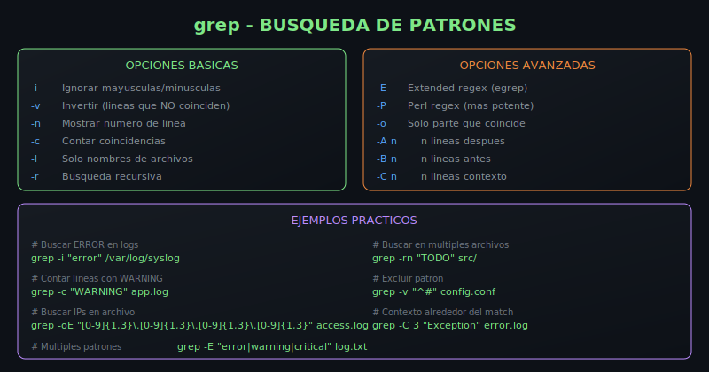
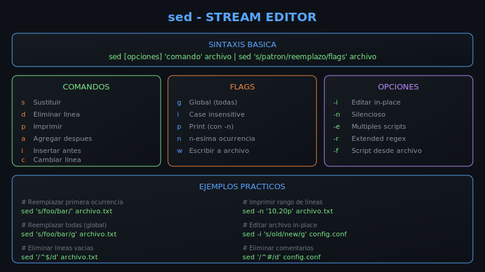
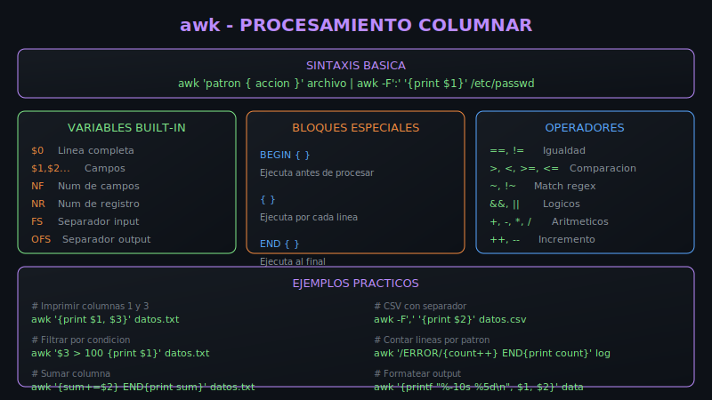

# 📅 Semana 5: Operaciones de Archivos y Procesamiento de Texto

<div align="center">
  
</div>

## 🎯 Objetivos de Aprendizaje

Al finalizar esta semana, serás capaz de:

- ✅ Dominar expresiones regulares básicas y avanzadas
- ✅ Usar grep con opciones avanzadas para búsquedas complejas
- ✅ Transformar texto con sed (sustitución, eliminación, rangos)
- ✅ Procesar datos columnares con awk
- ✅ Combinar herramientas en pipelines eficientes
- ✅ Analizar logs y generar reportes

---

## 📚 Requisitos Previos

- Completar Semana 4 (Control de Flujo y Funciones)
- Conocimiento básico de redirección y pipes
- Familiaridad con comandos de texto (cat, head, tail)

---

## 🗂️ Estructura de la Semana

```
week-05/
├── README.md                    # Este archivo
├── 0-assets/                    # Recursos visuales (SVGs)
│   ├── 01-expresiones-regulares.svg
│   ├── 02-grep-busqueda.svg
│   ├── 03-sed-transformacion.svg
│   └── 04-awk-columnas.svg
├── 1-teoria/                    # Material teórico
│   └── README.md                # Conceptos: regex, grep, sed, awk
├── 2-practicas/                 # Ejercicios guiados
│   ├── README.md                # Índice de prácticas
│   ├── practica-01-regex-basico/
│   ├── practica-02-grep-avanzado/
│   ├── practica-03-sed-transformaciones/
│   ├── practica-04-awk-columnas/
│   └── practica-05-integracion/
├── 3-proyecto/                  # Proyecto integrador
│   ├── README.md                # Analizador de Logs
│   ├── starter/
│   ├── solution/
│   └── data/
├── 4-recursos/                  # Recursos adicionales
│   └── README.md
└── 5-glosario/                  # Términos clave
    └── README.md
```

---

## 📝 Contenidos

### 1️⃣ Teoría

| Tema                  | Descripción                                     | Enlace                       |
| --------------------- | ----------------------------------------------- | ---------------------------- |
| Expresiones Regulares | Metacaracteres, anclas, clases, cuantificadores | [Teoría](1-teoria/README.md) |
| grep Avanzado         | Opciones, regex, contexto, recursividad         | [Teoría](1-teoria/README.md) |
| sed Transformaciones  | Sustitución, eliminación, rangos, grupos        | [Teoría](1-teoria/README.md) |
| awk Columnas          | Campos, variables, condiciones, cálculos        | [Teoría](1-teoria/README.md) |

### 2️⃣ Prácticas

| #   | Práctica                                                              | Duración | Contenido                        |
| --- | --------------------------------------------------------------------- | -------- | -------------------------------- |
| 1   | [Regex Básico](2-practicas/practica-01-regex-basico/)                 | 25 min   | Metacaracteres, anclas, clases   |
| 2   | [grep Avanzado](2-practicas/practica-02-grep-avanzado/)               | 25 min   | Opciones, ERE, contexto          |
| 3   | [sed Transformaciones](2-practicas/practica-03-sed-transformaciones/) | 30 min   | Sustitución, eliminación, grupos |
| 4   | [awk Columnas](2-practicas/practica-04-awk-columnas/)                 | 30 min   | Campos, variables, cálculos      |
| 5   | [Integración](2-practicas/practica-05-integracion/)                   | 35 min   | Pipelines grep+sed+awk           |

### 3️⃣ Proyecto

| Proyecto                          | Descripción                                             |
| --------------------------------- | ------------------------------------------------------- |
| [Analizador de Logs](3-proyecto/) | CLI que analiza logs, extrae métricas y genera reportes |

---

## ⏱️ Distribución del Tiempo

| Actividad    | Tiempo      |
| ------------ | ----------- |
| 📖 Teoría    | 1.5 horas   |
| 💻 Prácticas | 2.5 horas   |
| 🔬 Proyecto  | 2 horas     |
| **Total**    | **6 horas** |

---

## 🎨 Recursos Visuales

| Recurso                                         | Descripción                             |
| ----------------------------------------------- | --------------------------------------- |
|  | Metacaracteres, anclas, cuantificadores |
|           | Opciones y ejemplos de grep             |
|       | Sintaxis y comandos de sed              |
|             | Variables y bloques de awk              |

---

## 📌 Entregables

1. **Prácticas completadas**: 5 scripts funcionales
2. **Proyecto**: Analizador de logs operativo
3. **Autoevaluación**: Checklist de conceptos dominados

---

## 🧠 Conceptos Clave

### Expresiones Regulares

```bash
# Metacaracteres básicos
.     # Cualquier carácter
^     # Inicio de línea
$     # Fin de línea
*     # 0 o más del anterior
+     # 1 o más del anterior
?     # 0 o 1 del anterior
[]    # Clase de caracteres
```

### grep - Opciones Principales

```bash
grep -i "pattern"     # Case insensitive
grep -v "pattern"     # Invertir (excluir)
grep -n "pattern"     # Mostrar números de línea
grep -E "regex"       # Extended regex
grep -r "pattern"     # Recursivo en directorios
```

### sed - Comandos Básicos

```bash
sed 's/old/new/'      # Sustituir primera ocurrencia
sed 's/old/new/g'     # Sustituir todas (global)
sed '/pattern/d'      # Eliminar líneas
sed -i 's/a/b/g'      # Editar archivo in-place
```

### awk - Estructura

```bash
awk '{print $1}'                    # Primer campo
awk -F',' '{print $2}'              # Con delimitador
awk 'NR > 1 {print}'                # Saltar encabezado
awk '{sum+=$1} END {print sum}'     # Acumulador
```

---

## ✅ Checklist de Verificación

### Expresiones Regulares

- [ ] Uso correcto de metacaracteres (. ^ $ \* + ?)
- [ ] Clases de caracteres ([a-z], [0-9], etc.)
- [ ] Cuantificadores ({n}, {n,m})
- [ ] Grupos de captura con \( \) o ( )

### grep

- [ ] Búsquedas case-insensitive (-i)
- [ ] Búsquedas invertidas (-v)
- [ ] Extended regex (-E)
- [ ] Búsqueda recursiva (-r)
- [ ] Contexto (-A, -B, -C)

### sed

- [ ] Sustitución básica y global
- [ ] Eliminación de líneas
- [ ] Trabajo con rangos
- [ ] Grupos de captura y referencias
- [ ] Edición in-place (-i)

### awk

- [ ] Extracción de campos ($1, $2, $NF)
- [ ] Uso de separadores (-F)
- [ ] Variables (NR, NF, FS)
- [ ] Condiciones y filtros
- [ ] Bloques BEGIN y END
- [ ] Cálculos y acumuladores

### Integración

- [ ] Pipelines grep | sed | awk
- [ ] Análisis de logs
- [ ] Generación de reportes

---

## 🔗 Navegación

| ← Anterior              | Inicio          | Siguiente →             |
| ----------------------- | --------------- | ----------------------- |
| [Semana 4](../week-04/) | [Bootcamp](../) | [Semana 6](../week-06/) |

---

## 📚 Recursos Adicionales

- [regex101.com](https://regex101.com/) - Tester interactivo de regex
- [GNU grep Manual](https://www.gnu.org/software/grep/manual/)
- [GNU sed Manual](https://www.gnu.org/software/sed/manual/)
- [GNU awk Manual](https://www.gnu.org/software/gawk/manual/)
- [Ver más recursos](4-recursos/)

---

<div align="center">

**🚀 ¡Domina el procesamiento de texto con grep, sed y awk!**

</div>
