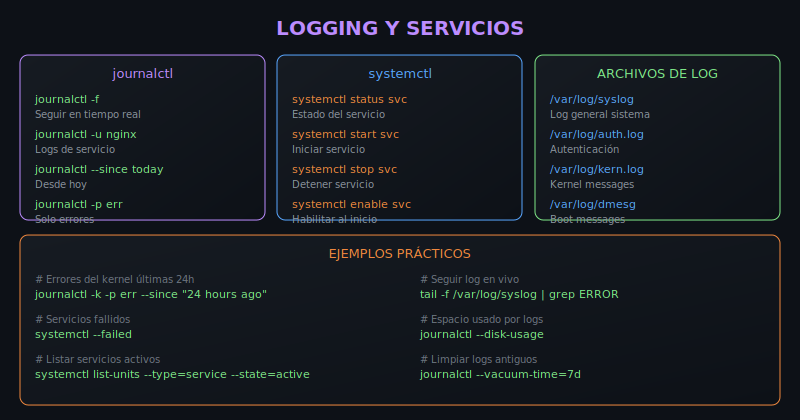

# 📝 Práctica 04: Logs y Servicios

> **Objetivo**: Dominar journalctl, systemctl y análisis de logs

---

## 📚 Recursos Visuales



---

## 📋 Contenido

### Paso 1: Journalctl Básico

Journalctl es la herramienta para leer logs de systemd:

```bash
journalctl              # Todos los logs
journalctl -f           # Seguir en tiempo real
journalctl -n 50        # Últimas 50 líneas
```

**Abre `starter/script.sh`** y descomenta la sección correspondiente.

---

### Paso 2: Filtrar por Servicio

Ver logs de un servicio específico:

```bash
journalctl -u nginx             # Logs de nginx
journalctl -u ssh               # Logs de SSH
journalctl -u cron              # Logs de cron
```

**Descomenta el Paso 2** en el script.

---

### Paso 3: Filtrar por Tiempo

Logs dentro de un rango de tiempo:

```bash
journalctl --since today
journalctl --since "1 hour ago"
journalctl --since "2024-01-01" --until "2024-01-02"
```

**Descomenta el Paso 3** en el script.

---

### Paso 4: Filtrar por Prioridad

Filtrar por nivel de severidad:

```bash
journalctl -p err        # Solo errores
journalctl -p warning    # Warnings y superiores
journalctl -p info       # Info y superiores
```

**Descomenta el Paso 4** en el script.

---

### Paso 5: Systemctl - Gestión de Servicios

Comandos para gestionar servicios:

```bash
systemctl status nginx   # Estado del servicio
systemctl start nginx    # Iniciar
systemctl stop nginx     # Detener
systemctl restart nginx  # Reiniciar
```

**Descomenta el Paso 5** en el script.

---

### Paso 6: Archivos de Log Tradicionales

Logs en /var/log para sistemas sin systemd:

```bash
/var/log/syslog         # Log general
/var/log/auth.log       # Autenticación
/var/log/kern.log       # Kernel
```

**Descomenta el Paso 6** en el script.

---

## ⚠️ Nota sobre Permisos

Algunos comandos requieren permisos de root.
El script manejará errores de permisos gracefully.

---

## ✅ Verificación

```bash
cd starter && chmod +x script.sh && ./script.sh
```

El script mostrará diferentes formas de analizar logs.

---

## 🔗 Navegación

← [Práctica 03](../practica-03-monitoreo/) | [Proyecto →](../../3-proyecto/)
