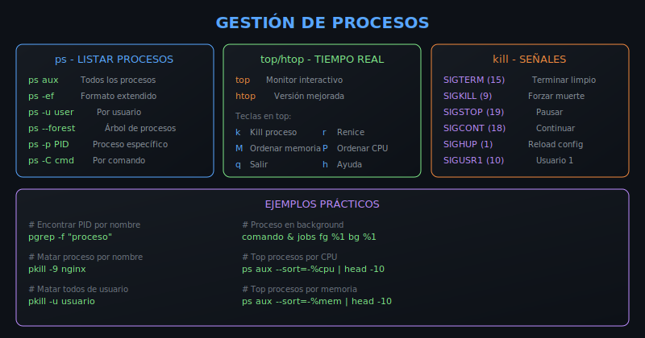
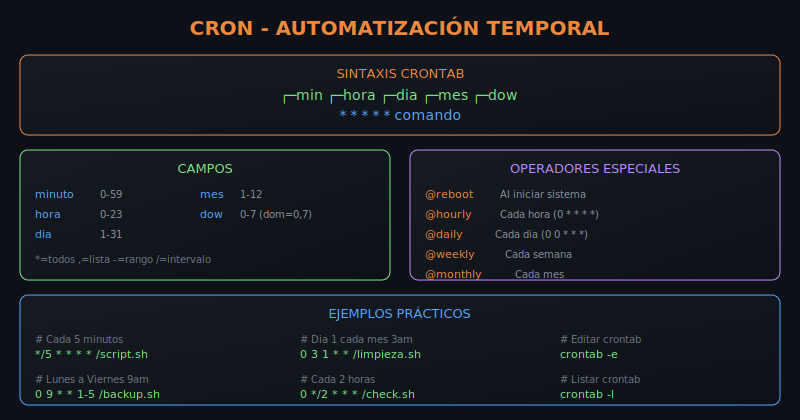

# 📚 Teoría - Semana 6: Herramientas del Sistema

> **Objetivo**: Dominar herramientas de administración de sistemas, procesos, automatización y monitoreo

---

## 🎨 Recursos Visuales

| Recurso                                            | Descripción                                   |
| -------------------------------------------------- | --------------------------------------------- |
|    | Gestión de procesos: ps, top, kill, señales   |
|     | Sintaxis cron y automatización temporal       |
|  | Métricas de sistema: disco, memoria, CPU, red |
|    | Logs, journalctl, systemctl                   |

---

## 🎯 ¿Qué son las Herramientas del Sistema?

Técnicas para **controlar, monitorear y automatizar** sistemas Linux de manera profesional.

## 🤔 ¿Para qué sirve?

### Casos de Uso Profesionales

- 🔄 **DevOps**: Gestión de procesos y servicios
- 📊 **SysAdmin**: Monitoreo proactivo de recursos
- ⏰ **Automatización**: Tareas programadas con cron
- 🔧 **Mantenimiento**: Limpieza y backups automáticos
- 🚨 **Alertas**: Detección temprana de problemas

---

## 📖 Conceptos Clave

### 1. Gestión de Procesos

**¿Qué es?** Control y monitoreo de procesos del sistema.

**¿Para qué?** Identificar problemas, optimizar recursos, automatizar.

```bash
# Listar procesos
ps aux                    # Todos los procesos
ps -ef --forest           # Árbol de procesos
pgrep -f "nombre"         # Buscar por nombre

# Matar procesos
kill PID                  # SIGTERM (limpio)
kill -9 PID               # SIGKILL (forzado)
pkill -f "patrón"         # Por patrón

# Proceso en background
comando &                 # Ejecutar en background
jobs                      # Listar jobs
fg %1                     # Traer al foreground
bg %1                     # Enviar a background
```

### Señales Importantes

| Señal   | Número | Descripción                    |
| ------- | ------ | ------------------------------ |
| SIGTERM | 15     | Terminar limpiamente (default) |
| SIGKILL | 9      | Forzar muerte inmediata        |
| SIGSTOP | 19     | Pausar proceso                 |
| SIGCONT | 18     | Continuar proceso pausado      |
| SIGHUP  | 1      | Recargar configuración         |

---

### 2. Automatización con Cron

**¿Qué es?** Programación de tareas temporales.

**¿Para qué?** Backups, limpieza, monitoreo periódico.

#### Sintaxis Crontab

```
┌─────── minuto (0-59)
│ ┌───── hora (0-23)
│ │ ┌─── día del mes (1-31)
│ │ │ ┌─ mes (1-12)
│ │ │ │ ┌ día de la semana (0-7, dom=0,7)
│ │ │ │ │
* * * * * comando
```

#### Operadores

| Operador | Significado       | Ejemplo                     |
| -------- | ----------------- | --------------------------- |
| `*`      | Todos los valores | `* * * * *` (cada minuto)   |
| `,`      | Lista de valores  | `0,30 * * * *` (min 0 y 30) |
| `-`      | Rango             | `9-17 * * * *` (9am a 5pm)  |
| `/`      | Intervalo         | `*/5 * * * *` (cada 5 min)  |

#### Ejemplos Comunes

```bash
# Cada 5 minutos
*/5 * * * * /scripts/check.sh

# Diario a las 3am
0 3 * * * /scripts/backup.sh

# Lunes a viernes 9am
0 9 * * 1-5 /scripts/report.sh

# Día 1 de cada mes
0 0 1 * * /scripts/monthly.sh

# Al reiniciar
@reboot /scripts/startup.sh
```

#### Gestión de Crontab

```bash
crontab -e                # Editar mi crontab
crontab -l                # Listar mis tareas
crontab -r                # Eliminar crontab
sudo crontab -u user -l   # Ver crontab de usuario
```

---

### 3. Monitoreo de Sistema

**¿Qué es?** Recolección de métricas del sistema.

**¿Para qué?** Detectar problemas antes de que ocurran.

#### Disco

```bash
df -h                     # Uso de particiones
df -i                     # Inodos disponibles
du -sh /path              # Tamaño de directorio
du -sh * | sort -h        # Ordenar por tamaño
lsblk                     # Lista de bloques
```

#### Memoria

```bash
free -h                   # RAM y swap
free -m                   # En megabytes
vmstat 1                  # Stats cada segundo
cat /proc/meminfo         # Info detallada
```

#### CPU

```bash
uptime                    # Load average
nproc                     # Número de CPUs
top -bn1 | head -20       # Snapshot
mpstat 1                  # Stats por CPU
```

#### Red

```bash
ss -tuln                  # Puertos escuchando
ss -s                     # Resumen de sockets
netstat -i                # Estadísticas interfaces
ip addr                   # Direcciones IP
```

#### Scripts de Monitoreo

```bash
# Alerta si disco > 80%
df -h | awk '$5+0 > 80 {print "ALERTA:", $6, $5}'

# Memoria disponible en MB
free -m | awk '/Mem:/{print $7}'

# Load average (1 min)
uptime | awk -F'load average:' '{print $2}' | cut -d',' -f1

# Procesos zombie
ps aux | awk '$8=="Z"' | wc -l
```

---

### 4. Logs y Servicios

**¿Qué es?** Gestión de logs y servicios del sistema.

**¿Para qué?** Debugging, auditoría, control de servicios.

#### Journalctl (systemd)

```bash
journalctl -f                      # Follow en tiempo real
journalctl -u nginx                # Logs de servicio
journalctl -u nginx --since today  # Desde hoy
journalctl -p err                  # Solo errores
journalctl -k                      # Kernel messages
journalctl --disk-usage            # Espacio usado
journalctl --vacuum-time=7d        # Limpiar >7 días
```

#### Systemctl

```bash
systemctl status nginx     # Estado del servicio
systemctl start nginx      # Iniciar
systemctl stop nginx       # Detener
systemctl restart nginx    # Reiniciar
systemctl reload nginx     # Recargar config
systemctl enable nginx     # Habilitar al boot
systemctl disable nginx    # Deshabilitar
systemctl --failed         # Servicios fallidos
systemctl list-units       # Listar unidades
```

#### Archivos de Log Tradicionales

| Archivo             | Contenido                 |
| ------------------- | ------------------------- |
| `/var/log/syslog`   | Log general del sistema   |
| `/var/log/auth.log` | Autenticación y seguridad |
| `/var/log/kern.log` | Mensajes del kernel       |
| `/var/log/dmesg`    | Boot messages             |
| `/var/log/apache2/` | Logs de Apache            |
| `/var/log/nginx/`   | Logs de Nginx             |

```bash
# Seguir log en vivo
tail -f /var/log/syslog

# Filtrar errores
grep -i error /var/log/syslog

# Últimas 100 líneas
tail -100 /var/log/auth.log
```

---

## 🔧 Buenas Prácticas

### Procesos

- Usar SIGTERM antes de SIGKILL
- Documentar procesos críticos
- Implementar reinicio automático para servicios críticos

### Cron

- Usar rutas absolutas en scripts
- Redirigir output a logs
- Documentar cada tarea
- Probar scripts manualmente antes de programar

```bash
# Ejemplo con logging
0 3 * * * /scripts/backup.sh >> /var/log/backup.log 2>&1
```

### Monitoreo

- Establecer umbrales de alerta
- Automatizar respuestas a problemas comunes
- Mantener histórico de métricas

### Logs

- Rotar logs automáticamente
- Centralizar logs críticos
- Configurar alertas por errores

---

## 📚 Referencias

- [GNU Coreutils](https://www.gnu.org/software/coreutils/manual/)
- [Systemd Documentation](https://www.freedesktop.org/wiki/Software/systemd/)
- [Cron Guru](https://crontab.guru/) - Generador de expresiones cron
- [Linux Performance](http://www.brendangregg.com/linuxperf.html)

---

## 🔗 Navegación

← [README](../README.md) | [Prácticas →](../2-practicas/)
