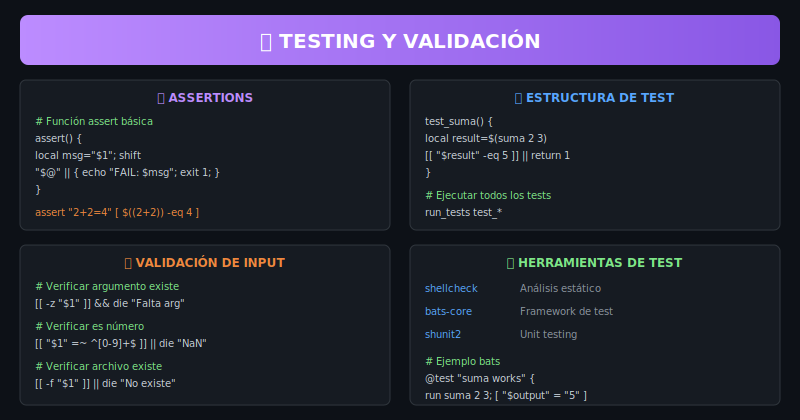

# 📚 Teoría - Semana 7: Debugging y Optimización

> **Objetivo**: Dominar técnicas de debugging, profiling y optimización de scripts Bash

---

## 🎨 Recursos Visuales

| Recurso                                                 | Descripción                                     |
| ------------------------------------------------------- | ----------------------------------------------- |
|      | Técnicas de debugging: echo, trap, herramientas |
|         | Opciones de set: -e, -u, -x, pipefail           |
|  | Profiling y optimización de performance         |
|        | Testing, assertions y validación                |

---

## 🎯 ¿Qué es Debugging y Optimización?

Técnicas para **encontrar y corregir errores** y **mejorar el rendimiento** de scripts Bash.

## 🤔 ¿Para qué sirve?

### Casos de Uso Profesionales

- 🐛 **Debugging**: Encontrar errores en scripts complejos
- ⚡ **Performance**: Scripts más rápidos y eficientes
- 🔒 **Robustez**: Código que maneja errores correctamente
- 🧪 **Testing**: Validar que el código funciona correctamente
- 📊 **Profiling**: Identificar cuellos de botella

---

## 📖 Conceptos Clave

### 1. Técnicas de Debugging

**¿Qué es?** Métodos para encontrar y diagnosticar errores en scripts.

#### Debug con Echo/Printf

```bash
# Debug básico
echo "DEBUG: variable=$variable" >&2

# Función de debug condicional
debug() {
    [[ -n "${DEBUG:-}" ]] && echo "[DEBUG] $*" >&2
}

# Usar: DEBUG=1 ./script.sh
debug "Procesando archivo: $file"
```

#### Debug con Trap

```bash
# Trap para cada línea ejecutada
trap 'echo "LINE $LINENO: $BASH_COMMAND"' DEBUG

# Trap para errores
trap 'echo "Error $? en línea $LINENO" >&2' ERR

# Trap de limpieza al salir
cleanup() {
    rm -f "$temp_file"
}
trap cleanup EXIT
```

#### Variables de Debug

| Variable        | Descripción                         |
| --------------- | ----------------------------------- |
| `$LINENO`       | Número de línea actual              |
| `$FUNCNAME`     | Nombre de la función actual         |
| `$BASH_SOURCE`  | Nombre del archivo                  |
| `$?`            | Código de salida del último comando |
| `$$`            | PID del script actual               |
| `$BASH_COMMAND` | Comando siendo ejecutado            |

---

### 2. Opciones de Bash (set)

**¿Qué es?** Configuraciones que modifican el comportamiento de Bash.

#### Manejo de Errores

```bash
#!/bin/bash
set -euo pipefail

# set -e (errexit)
# Exit inmediatamente si un comando falla

# set -u (nounset)
# Error si se usa una variable no definida

# set -o pipefail
# El pipe retorna el error del primer comando que falle
```

#### Debugging

```bash
set -x    # xtrace: mostrar cada comando antes de ejecutar
set -v    # verbose: mostrar líneas como se leen
set -n    # noexec: verificar sintaxis sin ejecutar

# Activar/Desactivar
set -x    # activar con guion
set +x    # desactivar con plus

# Debug de una sección específica
set -x
# código a debuggear
set +x
```

#### Combo Recomendado

```bash
#!/bin/bash
set -euo pipefail

# Esto es equivalente a:
# set -e      # exit on error
# set -u      # error on undefined vars
# set -o pipefail  # pipe errors propagate
```

---

### 3. Profiling y Optimización

**¿Qué es?** Técnicas para medir y mejorar el rendimiento.

#### Medir Tiempo

```bash
# Tiempo total
time ./script.sh

# Medir secciones
start=$SECONDS
# ... código ...
echo "Duración: $((SECONDS - start)) segundos"

# Con mayor precisión
start=$(date +%s.%N)
# ... código ...
end=$(date +%s.%N)
echo "Duración: $(echo "$end - $start" | bc) segundos"
```

#### Profiling con PS4

```bash
# Timestamp por línea
PS4='+$SECONDS:$LINENO: '
set -x
./script.sh

# Con fecha completa
PS4='+$(date "+%s.%N"):$LINENO: '
bash -x script.sh 2>trace.log
```

#### Optimizaciones Comunes

```bash
# ❌ LENTO: Subshells innecesarios
result=$(echo "$var" | cut -d':' -f1)

# ✅ RÁPIDO: Built-ins de Bash
result="${var%%:*}"

# ❌ LENTO: cat innecesario (UUOC)
cat file.txt | grep "pattern"

# ✅ RÁPIDO: grep directo
grep "pattern" file.txt

# ❌ LENTO: Loop para procesar texto
while read line; do
    echo "$line" | grep "pattern"
done < file.txt

# ✅ RÁPIDO: Herramientas especializadas
grep "pattern" file.txt
```

#### Tips de Performance

| Evitar             | Preferir     | Razón                |
| ------------------ | ------------ | -------------------- |
| `$(echo $var)`     | `$var`       | Subshell innecesario |
| `[ ]`              | `[[ ]]`      | Built-in más rápido  |
| `cat file \| cmd`  | `cmd < file` | Evita fork           |
| Loop + grep        | `grep file`  | Una sola invocación  |
| Variables globales | `local`      | Scope más limpio     |

---

### 4. Testing y Validación

**¿Qué es?** Técnicas para verificar que el código funciona correctamente.

#### Función Assert

```bash
assert() {
    local message="$1"
    shift
    if ! "$@"; then
        echo "ASSERTION FAILED: $message" >&2
        exit 1
    fi
}

# Uso
assert "2+2 debe ser 4" [ $((2+2)) -eq 4 ]
assert "archivo existe" [ -f "$file" ]
```

#### Estructura de Tests

```bash
#!/bin/bash
# test_functions.sh

source ./functions.sh

test_suma() {
    local result
    result=$(suma 2 3)
    [[ "$result" -eq 5 ]] || return 1
}

test_resta() {
    local result
    result=$(resta 5 3)
    [[ "$result" -eq 2 ]] || return 1
}

# Runner de tests
run_tests() {
    local passed=0 failed=0

    for test_func in $(declare -F | grep "test_" | cut -d' ' -f3); do
        if $test_func; then
            echo "✅ $test_func"
            ((passed++))
        else
            echo "❌ $test_func"
            ((failed++))
        fi
    done

    echo ""
    echo "Passed: $passed, Failed: $failed"
    [[ $failed -eq 0 ]]
}

run_tests
```

#### Validación de Input

```bash
# Verificar argumento existe
validate_args() {
    [[ $# -lt 1 ]] && die "Uso: $0 <archivo>"
}

# Verificar es número
is_number() {
    [[ "$1" =~ ^[0-9]+$ ]]
}

# Verificar archivo existe
validate_file() {
    [[ -f "$1" ]] || die "Archivo no existe: $1"
}

# Función die
die() {
    echo "ERROR: $*" >&2
    exit 1
}
```

#### Herramientas de Testing

| Herramienta    | Descripción                    |
| -------------- | ------------------------------ |
| **shellcheck** | Análisis estático de scripts   |
| **bats-core**  | Framework de testing para Bash |
| **shunit2**    | Unit testing framework         |
| **bash -n**    | Verificar sintaxis             |

```bash
# ShellCheck
shellcheck script.sh

# Bats example
@test "suma de 2+3 es 5" {
    run suma 2 3
    [ "$output" = "5" ]
}
```

---

## 🔧 Buenas Prácticas

### Debugging

- Usar `set -euo pipefail` al inicio de scripts
- Implementar función `debug()` condicional
- Usar trap para limpieza y manejo de errores
- Mantener logs de debug en stderr (`>&2`)

### Performance

- Preferir built-ins sobre comandos externos
- Evitar subshells innecesarios
- Usar `[[ ]]` en lugar de `[ ]`
- Procesar archivos grandes con awk/sed, no loops

### Testing

- Escribir tests para funciones críticas
- Validar todos los inputs
- Usar ShellCheck en CI/CD
- Documentar casos edge

---

## 📚 Referencias

- [Bash Reference Manual - Set Builtin](https://www.gnu.org/software/bash/manual/html_node/The-Set-Builtin.html)
- [ShellCheck Wiki](https://www.shellcheck.net/wiki/)
- [Bats-core Documentation](https://bats-core.readthedocs.io/)
- [Google Shell Style Guide](https://google.github.io/styleguide/shellguide.html)

---

## 🔗 Navegación

← [README](../README.md) | [Prácticas →](../2-practicas/)
