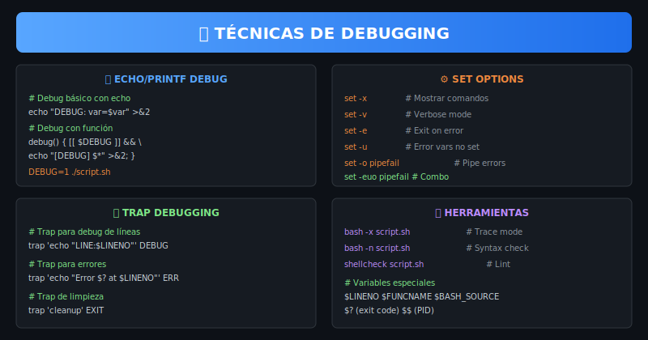

# 🪤 Práctica 02: Traps y Manejo de Errores

> **Objetivo**: Implementar manejo robusto de errores con trap

---

## 📚 Recursos Visuales



---

## 📋 Contenido

### Paso 1: Trap Básico - EXIT

Ejecutar código al salir del script (siempre):

```bash
cleanup() {
    echo "Limpiando recursos..."
    rm -f "$temp_file"
}
trap cleanup EXIT

# El cleanup se ejecuta al terminar, incluso con errores
```

**Abre `starter/script.sh`** y descomenta la sección correspondiente.

---

### Paso 2: Trap ERR

Capturar errores cuando un comando falla:

```bash
on_error() {
    echo "Error en línea $LINENO" >&2
}
trap on_error ERR
```

**Descomenta el Paso 2** en el script.

---

### Paso 3: Trap DEBUG

Ejecutar código antes de cada comando:

```bash
trap 'echo "Ejecutando: $BASH_COMMAND"' DEBUG

# Útil para tracing detallado
```

**Descomenta el Paso 3** en el script.

---

### Paso 4: Trap para Señales

Manejar señales del sistema (SIGINT, SIGTERM):

```bash
trap 'echo "Ctrl+C detectado"; exit 1' SIGINT
trap 'echo "Terminación solicitada"; exit 0' SIGTERM
```

**Descomenta el Paso 4** en el script.

---

### Paso 5: Combinar Traps

Usar múltiples traps juntos para manejo completo:

```bash
trap cleanup EXIT
trap on_error ERR
trap on_interrupt SIGINT
```

**Descomenta el Paso 5** en el script.

---

### Paso 6: Función die()

Patrón común para errores fatales:

```bash
die() {
    echo "ERROR: $*" >&2
    exit 1
}

[[ -f "$file" ]] || die "Archivo no existe: $file"
```

**Descomenta el Paso 6** en el script.

---

## ✅ Verificación

```bash
cd starter && chmod +x script.sh && ./script.sh
```

---

## 🔗 Navegación

← [Práctica 01](../practica-01-debugging/) | [Práctica 03 →](../practica-03-profiling/)
