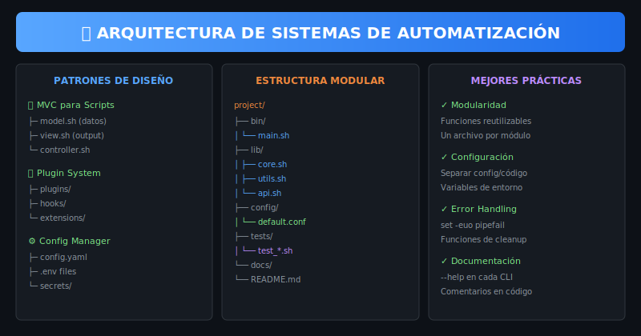
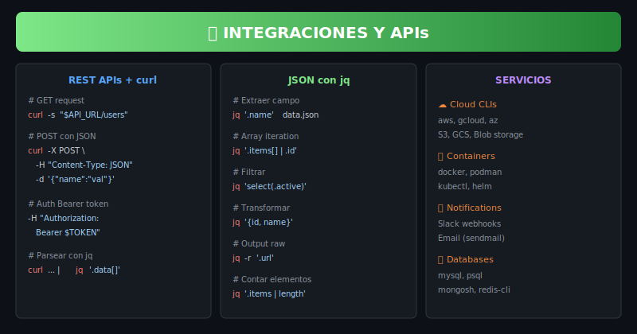

# 📖 Teoría - Semana 8: Proyectos Avanzados y Automatización

> **Objetivo**: Integrar todo lo aprendido para crear sistemas de automatización profesionales

---

## 🎨 Recursos Visuales

| Recurso                                                   | Descripción              |
| --------------------------------------------------------- | ------------------------ |
|  | Patrones de arquitectura |
|    | Orquestación y pipelines |
|             | Integraciones externas   |
|                  | CI/CD y automatización   |

---

## 📚 Contenidos

### 1. Arquitectura de Sistemas

#### Estructura de Proyecto Profesional

```
mi-proyecto/
├── bin/                    # Ejecutables principales
│   └── main.sh
├── lib/                    # Librerías y módulos
│   ├── core.sh
│   ├── utils.sh
│   └── api.sh
├── config/                 # Configuraciones
│   ├── default.conf
│   └── production.conf
├── tests/                  # Tests
│   └── test_*.sh
├── docs/                   # Documentación
│   └── README.md
├── Makefile               # Comandos de build
└── README.md
```

#### Patrón de Entrada Principal

```bash
#!/bin/bash
# bin/main.sh - Punto de entrada

set -euo pipefail

SCRIPT_DIR="$(cd "$(dirname "${BASH_SOURCE[0]}")" && pwd)"
PROJECT_ROOT="$(dirname "$SCRIPT_DIR")"

# Cargar librerías
source "$PROJECT_ROOT/lib/core.sh"
source "$PROJECT_ROOT/lib/utils.sh"

# Cargar configuración
config_load "$PROJECT_ROOT/config/default.conf"

main() {
    log_info "Starting application..."
    # Lógica principal
}

[[ "${BASH_SOURCE[0]}" == "$0" ]] && main "$@"
```

---

### 2. Workflows y Pipelines

#### Pipeline Básico

```bash
run_pipeline() {
    local stages=("validate" "build" "test" "deploy")

    for stage in "${stages[@]}"; do
        log_info "Running stage: $stage"
        "stage_$stage" || {
            log_error "Stage $stage failed"
            return 1
        }
    done

    log_info "Pipeline completed successfully"
}

stage_validate() {
    shellcheck bin/*.sh lib/*.sh
}

stage_build() {
    # Preparar artefactos
    mkdir -p dist
    cp -r bin lib dist/
}

stage_test() {
    ./run-tests.sh
}

stage_deploy() {
    # Deploy a producción
    rsync -av dist/ server:/app/
}
```

#### Estado Persistente

```bash
# Guardar estado entre ejecuciones
save_state() {
    local state_file=".pipeline_state"
    declare -p PIPELINE_STATE > "$state_file"
}

load_state() {
    local state_file=".pipeline_state"
    [[ -f "$state_file" ]] && source "$state_file"
}
```

---

### 3. APIs y curl

#### Funciones para REST APIs

```bash
# GET request
api_get() {
    local endpoint="$1"
    curl -s -H "Authorization: Bearer $API_TOKEN" \
         "$API_BASE_URL/$endpoint"
}

# POST con JSON
api_post() {
    local endpoint="$1"
    local data="$2"
    curl -s -X POST \
         -H "Authorization: Bearer $API_TOKEN" \
         -H "Content-Type: application/json" \
         -d "$data" \
         "$API_BASE_URL/$endpoint"
}

# Ejemplo de uso
get_users() {
    api_get "users" | jq '.data[]'
}

create_user() {
    local name="$1"
    local email="$2"
    api_post "users" "{\"name\":\"$name\",\"email\":\"$email\"}"
}
```

#### jq Avanzado

```bash
# Extraer campos específicos
jq '.name'                    # Campo simple
jq '.users[0].email'          # Array + objeto
jq '.items[] | .id'           # Iterar array

# Filtrar
jq 'select(.active == true)'  # Por condición
jq '.[] | select(.age > 18)'  # En array

# Transformar
jq '{id, name}'               # Seleccionar campos
jq '{userId: .id}'            # Renombrar

# Output raw (sin comillas)
jq -r '.url'

# Crear JSON
jq -n --arg name "$NAME" '{name: $name}'
```

---

### 4. CI/CD y Git Hooks

#### Pre-commit Hook

```bash
#!/bin/bash
# .git/hooks/pre-commit

set -euo pipefail

echo "Running pre-commit checks..."

# Lint
echo "→ ShellCheck..."
shellcheck bin/*.sh lib/*.sh || exit 1

# Tests rápidos
echo "→ Quick tests..."
./run-tests.sh --quick || exit 1

# Formateo
echo "→ Format check..."
shfmt -d bin/*.sh lib/*.sh || exit 1

echo "✅ All checks passed"
```

#### GitHub Actions Workflow

```yaml
# .github/workflows/ci.yml
name: CI

on: [push, pull_request]

jobs:
  test:
    runs-on: ubuntu-latest
    steps:
      - uses: actions/checkout@v4

      - name: Install dependencies
        run: |
          sudo apt-get install -y shellcheck

      - name: Lint
        run: shellcheck bin/*.sh lib/*.sh

      - name: Test
        run: ./run-tests.sh
```

---

### 5. Makefile para Automatización

```makefile
.PHONY: all test lint clean deploy

all: lint test

lint:
	shellcheck bin/*.sh lib/*.sh

test:
	./run-tests.sh

clean:
	rm -rf dist/ .cache/

build: clean
	mkdir -p dist
	cp -r bin lib config dist/

deploy: build
	rsync -av dist/ server:/app/

install-hooks:
	cp hooks/* .git/hooks/
	chmod +x .git/hooks/*
```

---

## 🎯 Mejores Prácticas

### Código

| Práctica        | Descripción                   |
| --------------- | ----------------------------- |
| Modularidad     | Un archivo por módulo         |
| Config separada | Variables en archivos .conf   |
| Error handling  | set -euo pipefail + trap      |
| Logging         | Funciones log_info, log_error |
| Documentación   | --help en cada CLI            |

### Proyecto

| Práctica   | Descripción                     |
| ---------- | ------------------------------- |
| README     | Documentación clara             |
| Tests      | Cobertura de funciones críticas |
| CI/CD      | Pipeline automatizado           |
| Versionado | Tags semánticos                 |
| Changelog  | Historial de cambios            |

---

## 📋 Checklist de Proyecto Profesional

- [ ] Estructura de carpetas organizada
- [ ] Punto de entrada claro (bin/main.sh)
- [ ] Librerías reutilizables (lib/)
- [ ] Configuración externa (config/)
- [ ] Tests automatizados
- [ ] Makefile con comandos útiles
- [ ] Git hooks configurados
- [ ] README completo
- [ ] CI/CD pipeline

---

## 🔗 Navegación

← [Assets](../0-assets/) | [Prácticas →](../2-practicas/)
