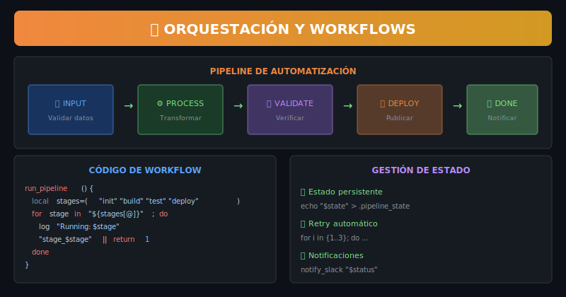

# 🔄 Práctica 02: Pipelines y Workflows

> **Objetivo**: Implementar pipelines de automatización con stages

---

## 🎨 Recurso Visual



---

## 📋 Pasos

### Paso 1: Pipeline Básico

Un pipeline ejecuta stages en secuencia:

```bash
stages=("init" "build" "test" "deploy")
for stage in "${stages[@]}"; do
    run_stage "$stage"
done
```

**Abre `starter/script.sh`** y descomenta la sección del Paso 1.

---

### Paso 2: Funciones de Stage

Cada stage es una función independiente:

```bash
stage_init()  { echo "Inicializando..."; }
stage_build() { echo "Compilando..."; }
stage_test()  { echo "Testeando..."; }
```

**Descomenta** la sección del Paso 2.

---

### Paso 3: Ejecución con Control de Errores

Detener el pipeline si un stage falla:

```bash
"stage_$name" || {
    echo "Stage $name falló"
    return 1
}
```

**Descomenta** la sección del Paso 3.

---

### Paso 4: Estado y Logging

Registrar progreso del pipeline:

```bash
log_stage() {
    local status="$1" stage="$2"
    echo "[$(date +%H:%M:%S)] $status: $stage"
}
```

**Descomenta** la sección del Paso 4.

---

### Paso 5: Retry Automático

Reintentar stages que fallan:

```bash
retry() {
    local max="$1" cmd="${@:2}"
    for ((i=1; i<=max; i++)); do
        $cmd && return 0
        sleep 1
    done
    return 1
}
```

**Descomenta** la sección del Paso 5.

---

### Paso 6: Pipeline Completo

Combinar todo en un runner de pipeline:

```bash
run_pipeline() {
    for stage in "${STAGES[@]}"; do
        log_stage "START" "$stage"
        "stage_$stage" && log_stage "PASS" "$stage" \
                       || { log_stage "FAIL" "$stage"; return 1; }
    done
}
```

**Descomenta** la sección del Paso 6.

---

## ✅ Verificación

```bash
chmod +x starter/script.sh
./starter/script.sh
```

Deberías ver el pipeline ejecutándose con timestamps.

---

## 🔗 Navegación

← [Práctica 01](../practica-01-arquitectura/) | [Práctica 03 →](../practica-03-apis/)
